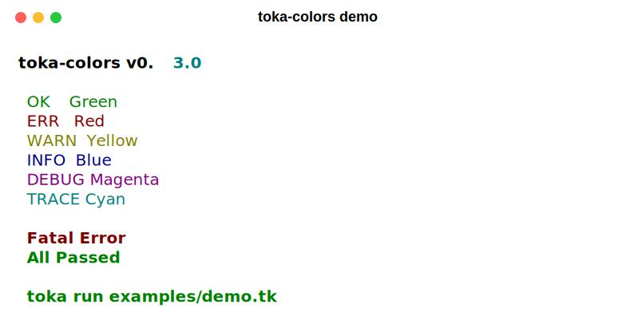

# toka-colors

ANSI terminal color library for [Toka](https://tokalang.dev).

## Usage

```toka
import std/io::{print_line}
import lib/toka_colors::{red, green, yellow, blue, bold_red, bold_green}
import std/string::{String}

pub fn main() -> i32 {
    print_line(cede green(String::from("Success!")))
    print_line(cede red(String::from("Error!")))
    print_line(cede bold_red(String::from("Fatal error!")))
    return 0
}
```

## API

### Foreground
`red(text)`, `green(text)`, `yellow(text)`, `blue(text)`, `magenta(text)`, `cyan(text)`

### Styles
`bold(text)`, `underline(text)`, `italic(text)`

### Combined
`bold_red(text)`, `bold_green(text)`, `bold_yellow(text)`, `bold_blue(text)`

### Background
`bg_red(text)`, `bg_green(text)`, `bg_blue(text)`, `bg_yellow(text)`

## Demo

```bash
toka run examples/demo.tk
```

## Screenshot



## License

Apache-2.0
